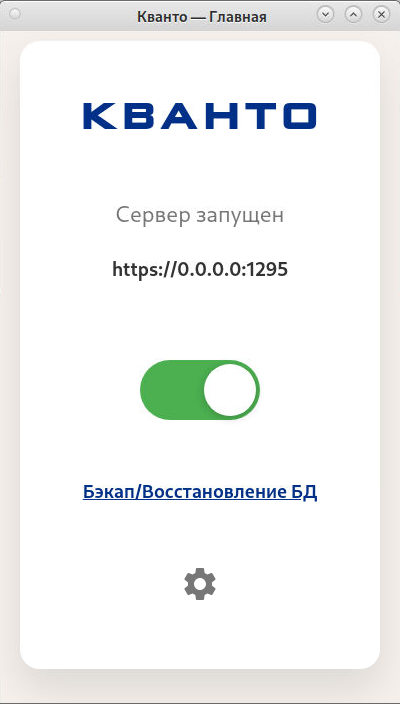
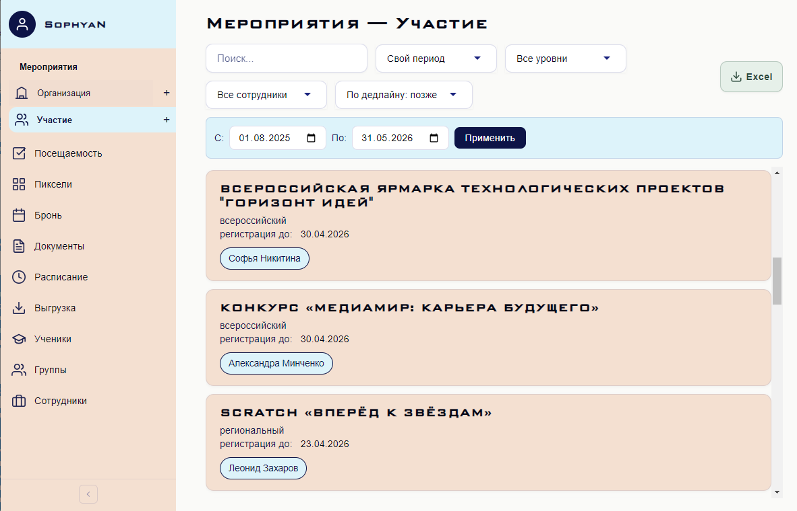

# Kvant

> Приложения **с открытым исходным кодом** для учебных заведений: сервер, компьютерная и мобильная версия на **вашей** инфраструктуре — чтобы **организовать операционную работу**, вести **посещаемость** и собирать **отчёты**. 

 

  
  &nbsp;
  
  &nbsp;
  

 

---

## Компоненты

| | **Kvant Server** | **Kvant Desktop** | **Kvant Mobile** |
| :--- | :--- | :--- | :--- |
| **Назначение** | База данных, HTTPS, API, JWT — ядро на вашей инфраструктуре | Клиент для ПК: повседневная работа через привычный интерфейс | Те же сценарии на смартфоне, общее API с десктопом |
| **Для кого** | Администратор, который разворачивает систему | Администраторы, сотрудники, преподаватели, координаторы | Сотрудники и администраторы вне рабочего места |
| **Старт** | MySQL → установщик из Releases → `DATABASE_CONN`, `API_PORT` → проброс порта при необходимости | Releases → установить → указать **URL API** → войти | Releases → установить → тот же **адрес API** → авторизация |

Подробные инструкции по установке, сборке и troubleshooting — в README соответствующего репозитория (кнопки выше).

---

  
  &nbsp;&nbsp;
  

---

## Кому подойдёт

|  |
| :--- |
| школы и колледжи; |
| детские технопарки; |
| центры дополнительного образования; |
| курсы; |
| учебные центры и кружки. |

---

## Функционал

| Модуль | Возможности |
| :--- | :--- |
| Доступ и профиль | <ul><li><strong>Подключение</strong> к серверу по адресу</li><li><strong>Вход</strong> по логину и паролю</li><li><strong>Профиль</strong> текущего пользователя</li><li><strong>Восстановление сессии</strong> автоматически</li><li><strong>Выход</strong> из аккаунта</li></ul> |
| Сотрудники | <ul><li><strong>Списки</strong> активных сотрудников и полный состав, включая неактивных</li><li><strong>Карточки</strong> — добавление и редактирование</li><li><strong>Должности</strong></li><li><strong>Размеры</strong> сотрудников</li><li><strong>Экспорт</strong> в Excel</li><li><strong>Доступ</strong> — ограничение административных действий по уровню</li></ul> |
| Мероприятия | <ul><li>тип <strong>«Организация»</strong> — мероприятия, которые проводит учреждение</li><li>тип <strong>«Участие»</strong> — мероприятия с участием сотрудников и учеников</li><li><strong>Списки</strong>, поиск, фильтры и сортировка (периоды, даты, ответственные, типы)</li><li><strong>Создание</strong>, изменение и удаление</li><li><strong>Ответственные</strong> — назначение и учёт результатов</li><li><strong>Заявки</strong> — отметка отправки (тип «Участие»)</li><li><strong>Вложения</strong> — файлы на диске сервера; в БД метаданные (имя, путь, размер, тип, порядок, автор)</li><li><strong>Экспорт</strong> в Excel</li></ul> |
| Бронь помещений | <ul><li><strong>Просмотр</strong> по мероприятию и по дате с комнатой</li><li><strong>Бронь</strong> — создание, редактирование и удаление</li><li><strong>Связь</strong> аренды с мероприятиями организации</li></ul> |
| Ученики | <ul><li><strong>Поиск</strong> и карточка</li><li><strong>Создание</strong> и редактирование</li><li><strong>Проверка</strong> существования по ФИО</li><li><strong>Группы</strong> — добавление, исключение, перевод</li><li><strong>Просмотр</strong> групп ученика</li></ul> |
| Группы | <ul><li><strong>Список</strong> групп и состав</li><li><strong>Массовые действия</strong>: удалить все группы; очистить учеников; очистить пиксели; очистить посещаемость</li><li><strong>Экспорт</strong> одной группы или всех групп в Excel</li></ul> |
| Посещаемость | <ul><li><strong>Просмотр</strong> по группе, таблица по датам занятий</li><li><strong>Редактирование</strong> по группе и дате</li><li><strong>Подгрузка</strong> списка учеников автоматически</li><li><strong>Отметки</strong> присутствия и отсутствия</li><li><strong>Расчёт</strong> процента посещаемости по ученику</li><li><strong>Очистка</strong> данных при наличии прав</li></ul> |
| Пиксели (мотивация) | <ul><li><strong>Начисление баллов</strong> по критериям и с учётом посещаемости</li><li><strong>Шкала</strong> — перевод процента посещаемости в баллы (см. ниже)</li><li><strong>Несколько групп</strong> — для расчёта берётся лучший процент</li><li><strong>Экспорт</strong> в Excel</li></ul> |
| Расписание | <ul><li><strong>Просмотр</strong> и выборки по преподавателю, группе и комнате</li><li><strong>На сервере</strong> — создание, изменение и удаление занятий</li></ul> |
| Документы | <ul><li><strong>Шаблоны</strong> — быстрый доступ к документам</li></ul> |

**Шкала посещаемости → баллы:**

1. 94–100% → 100 баллов  
2. 85–93% → 80 баллов  
3. 70–84% → 60 баллов  
4. 40–69% → 30 баллов  
5. менее 40% → 0 баллов  

<strong>Критерии начисления пикселей</strong> (нажмите, чтобы развернуть)

- участие в конкурсах;
- создание контента;
- привёл друга;
- уборка;
- проектная карта;
- закрытие проекта;
- конкурсы разных уровней;
- НТО;
- волонтёрство;
- помощь с мероприятием;
- собственное мероприятие;
- особые достижения;
- штрафы.

---

## Быстрый старт

| № | Шаг |
| :---: | :--- |
| 1 | **[Сервер](https://github.com/nisonya/kvant-server)** — README и Releases → установщик → MySQL и настройки → проброс порта при необходимости. |
| 2 | **[Компьютерная версия](https://github.com/nisonya/kvant-desktop)** — Releases → установить → указать URL API → войти. |
| 3 | **[Мобильная](https://github.com/nisonya/kvant-mobile)** — Releases → установить → тот же адрес API. |
