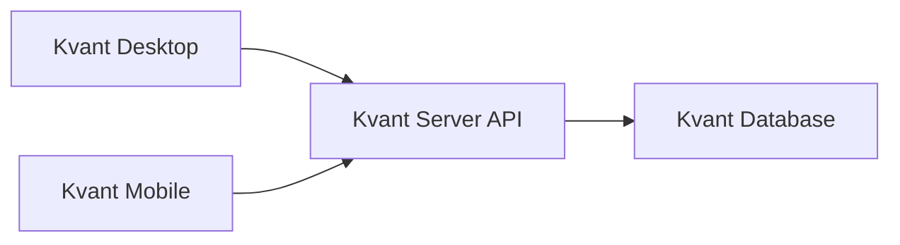

# Kvant Desktop

**Клиент для ПК:** повседневная работа с Kvant через привычный интерфейс на вашем сервере.

---

### Кому это нужно

Администраторы · сотрудники учреждения · преподаватели и координаторы · операторы внутренних процессов — роли можно уточнить под ваш продукт.

---

### Что вы получаете

Подключение к **своему** Kvant Server · установщик из Releases · исходники под брендинг и доработку сценариев.

---

### Установка за несколько шагов

1. **Releases** → установщик под вашу ОС.
2. Установить → запустить **Kvant Desktop**.
3. Указать **URL API** сервера → войти учёткой от администратора.

Примеры адреса:

```text
http://192.168.1.10:8080
http://localhost:8080
```

---

### Не подключается?

Проверьте по списку: сервер запущен · порт API доступен · машина видит сервер по сети · URL без опечаток.

---

### Как устроено подключение

Данные живут на сервере; клиент общается только по API.



---

### Сборка из исходников

```bash
git clone https://github.com/<owner>/kvant-desktop.git
cd kvant-desktop
```

Зависимости и команды сборки — по вашему desktop-стеку (пропишите здесь после выбора инструментов).

Имеет смысл добавить: `docs/build.md`, `docs/release.md`, `.env.example`, скриншоты экранов.

---

### Идеи для кастомизации

Язык и терминология · роли · формы и процессы · визуальный стиль · интеграции · пресеты адреса сервера для своих деплоев.

---

### Нашли баг?

**GitHub Issues:** ОС · версия клиента · версия сервера · шаги воспроизведения · скрин или лог при возможности.

---

### Лицензия

В репозитории должен быть файл **`LICENSE`**. Для свободных форков обычно выбирают **MIT**.
