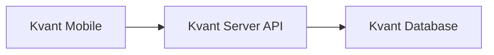

# Kvant Mobile

**Тот же сервер — в кармане:** ключевые сценарии Kvant на смартфоне через общее API с десктопом.

---

### Для кого приложение

Сотрудники и администраторы · преподаватели · любой сценарий, где нужен быстрый доступ вне стола · команды, которые хотят свой мобильный UI поверх вашего API.

---

### Что внутри по смыслу

Свой сервер · основные пользовательские потоки · единый контракт API с десктопом · открытый код под форки и бренд.

---

### Как поставить из релиза

1. **Releases** → сборка под вашу платформу.
2. Установить → открыть **Kvant Mobile**.
3. Ввести **адрес API** → авторизация как у других клиентов.

Пример для локальной сети:

```text
http://192.168.1.10:8080
```

Доступ извне — только через **HTTPS** и продуманную модель доступа (VPN, домен, ограничения).

---

### Нет связи с сервером?

Сервер работает · телефон достигает хоста · верный URL · VPN/внутренняя сеть, если сервер не в интернете · для внешки — HTTPS и корректные сертификаты.

---

### Архитектура в одной схеме



---

### Разработчикам

```bash
git clone https://github.com/<owner>/kvant-mobile.git
cd kvant-mobile
```

Дальше — типичный цикл вашего mobile-стека (команды добавьте после выбора фреймворка).

Желательно: `docs/build.md`, `docs/release.md`, `.env.example`, скриншоты, явный список поддерживаемых платформ.

---

### Что обычно кастомизируют

Язык · набор экранов и ролей · брендинг · push · интеграции с внутренними сервисами.

---

### Безопасность на мобильном контуре

Без HTTPS не выносите API наружу · сильные пароли и роли · для «только наш офис» — VPN или закрытый endpoint · секреты не в git.

---

### Issues и обратная связь

В заявке укажите: платформа и версия ОС · версия приложения · версия сервера · шаги · скрин/лог.

---

### Лицензия

Добавьте **`LICENSE`**; для широкого распространения чаще всего берут **MIT**.
